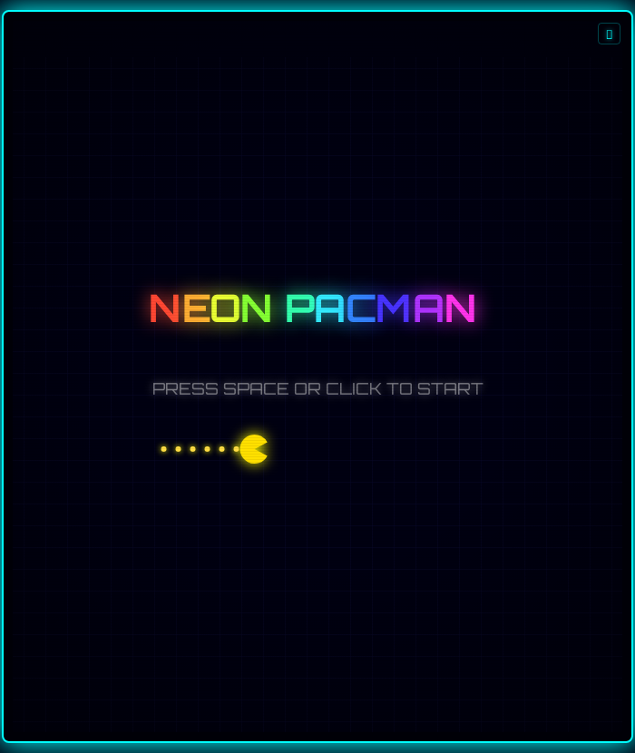

# 🕹️ NEON PACMAN

A fully playable Pac-Man game **JUICED TO 1000%** with neon glow effects, particles, screen shake, and an EDM soundtrack. Pure HTML5 Canvas — no frameworks, no dependencies.

## 🎮 Play

Open `index.html` in any modern browser, or play live at the hosted URL.

**Controls:**
- **Arrow Keys** or **WASD** — Move Pac-Man
- **Space** — Start / Restart
- **Click** — Start / Restart
- **🔊 Button** — Toggle sound

## ✨ Features

- Classic 28×31 maze with proper ghost AI (Blinky, Pinky, Inky, Clyde)
- Ghost scatter/chase mode alternation with timers
- Power pellets with frightened ghost mode
- Escalating ghost eat points (200 → 400 → 800 → 1600)
- Level progression with increasing difficulty
- 3 lives system with death animation

### 🌈 Juice Effects

- Neon glow on everything (walls, dots, ghosts, Pac-Man)
- Chromatic aberration on Pac-Man
- Rainbow-cycling power pellets
- Particle trails and explosions
- Screen shake on ghost eat and death
- CRT scanlines and vignette overlay
- Animated scrolling background grid
- Rainbow title screen text
- Floating score text on ghost eat

### 🔊 Audio

- EDM background music (CC0 licensed)
- Synthesized sound effects via Web Audio API

## 📜 License

This project is licensed under the **GNU General Public License v3.0** — see [LICENSE](LICENSE).

### Music Credit

Background music: "Aggression" from Bonnot's Music Collection  
Source: [Internet Archive](https://archive.org/details/musiccollect)  
License: CC0 1.0 Universal (Public Domain)

## 🛠️ Tech

- Pure HTML5 Canvas + JavaScript
- Web Audio API for sound effects
- No build step, no dependencies
- Single HTML file (~1000 lines)
